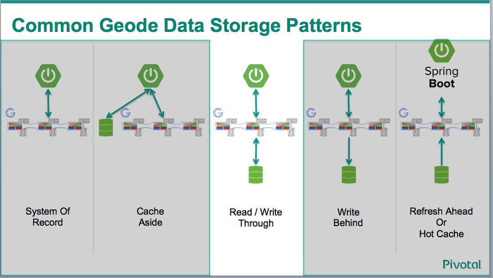
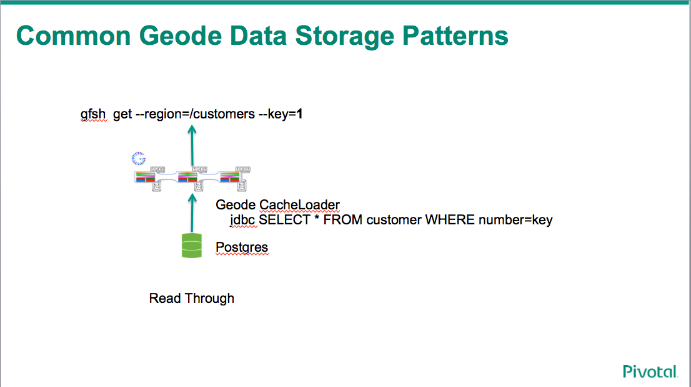
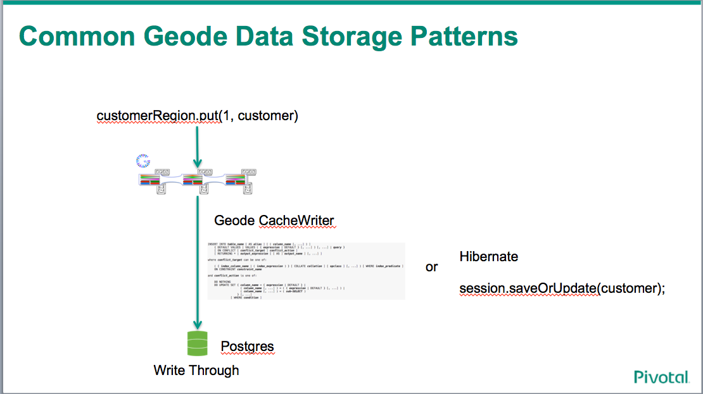

# Implementing The Read / Write through pattern With GemFire

This project contains the material I created in a youtube video.    In the video I walked though implementing the read and write portions of this pattern.

The read/write through pattern allows GemFire to potentially lazy load and cache data from a back end store.   In the video I used Postgres as the backend data source, but the back end store could be nearly any thing that one would like to cache.   

We can also combine the various storage patterns to enable GemFire to satify nearly any application requirements. 

Maybe we are caching for performance or we caching for cost - GemFire can support it.   The good example for caching for cost is mainframes where each call to the mainframe results in extra MIPS.

## The Read Pattern

In the read pattern we are using GemFire to cache results from the back end system.   In the example below we are using JDBC to retrive data from some data base.   

Once we have the result GemFire uses that value and the provided key and stores it in the region the cache loader is associated with.

## The Write Pattern

In the write pattern we use GemFire to write the result to the backend data source.   Once write has successfully been completed GemFire then commits the value to the regions associated with the cache writer.

# YouTube

If you would like a guided walk through and coding up see the following youtube video:

https://youtu.be/jWDePZcjTH4    
